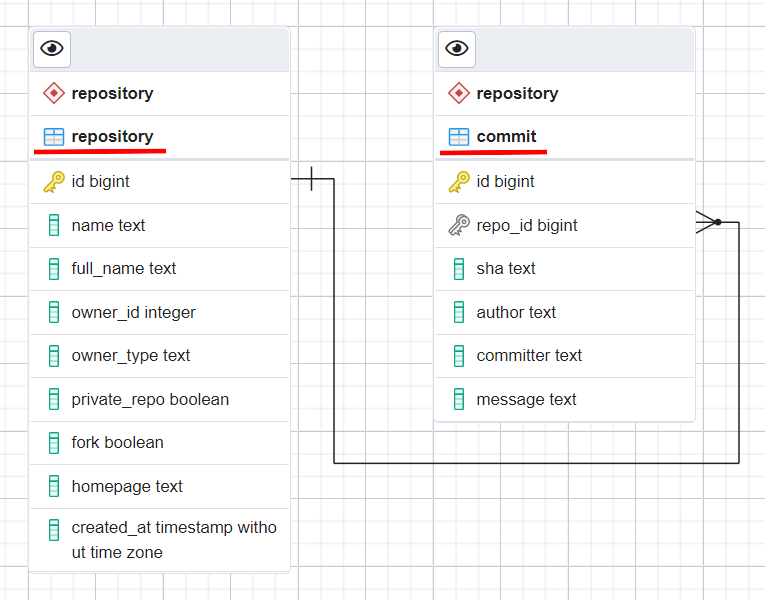
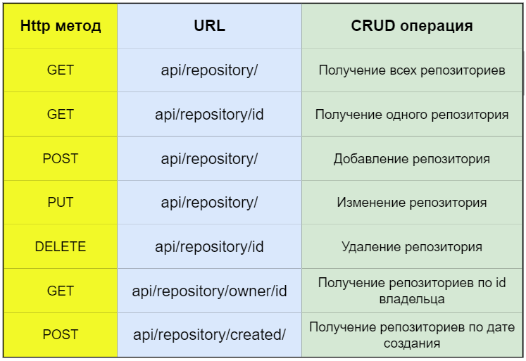
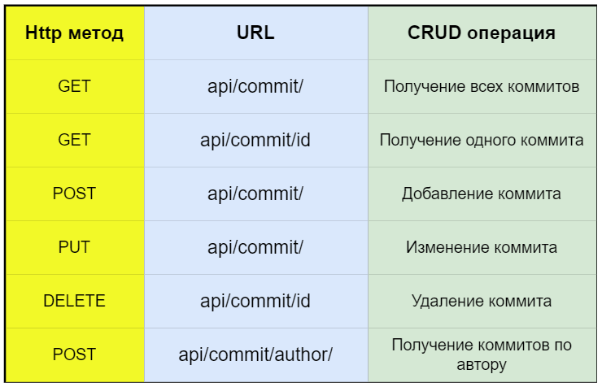
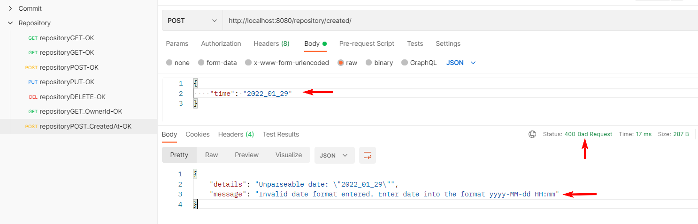
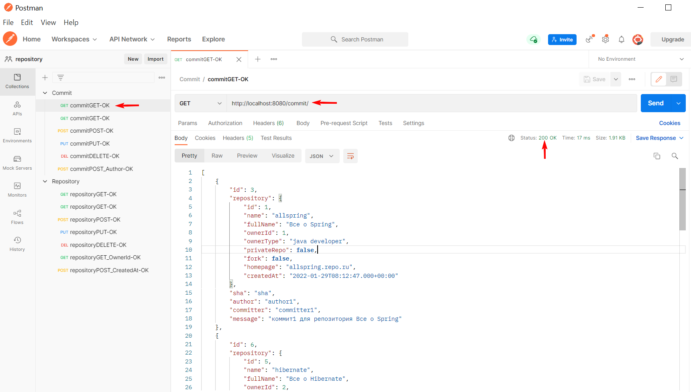

#### Описание проекта Репозиторий.

Репозиторий - это RESTful-приложение с использованием технологий Javа, Spring и архитектуры REST.

Данные передаются в формате JSON.

Для хранения данных используется PostgreSQL.

Схема базы данных:

SQL - запросы для создания таблиц - в db/update.sql

API приложения:

Обработка исключений:
реализована в классе GlobalExceptionHandler.

Скриншоты тестирования в Postman - в /resources/pictures/postman/:

Используемые технологии:
- Java 11, Maven;
- Spring boot, Spring REST, Spring Data
- PostgreSQL;
- Postman;

